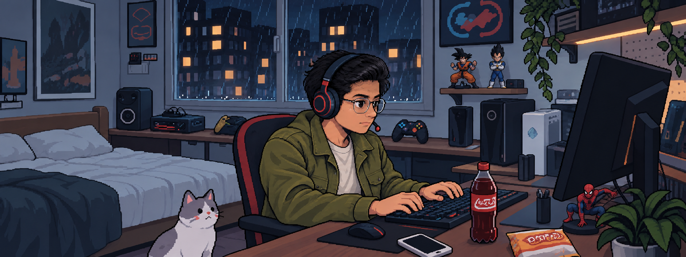

<link rel="preconnect" href="https://fonts.googleapis.com">
<link rel="preconnect" href="https://fonts.gstatic.com" crossorigin>
<link href="https://fonts.googleapis.com/css2?family=Pixelify+Sans:wght@400..700&display=swap" rel="stylesheet">

  

  

<h1 align="center">Hi, I'm Abhishek</h1>
<h3 align="center">Backend and AI Engineer | Go, Python and TypeScript Stacks</h3>

---

### 🚀 About Me

- 💼 Currently working as a **Backend and AI Engineer**
- ⚙️ Primary language: **Go**, with experience in **Python** and **Typescript**

---

### 🛠️ Tech Stack

- **Backend:** Go, Java, Python, Typescript  
- **Frontend:** TypeScript, React  
- **Core Skills:** System Design, APIs, Distributed Systems  
